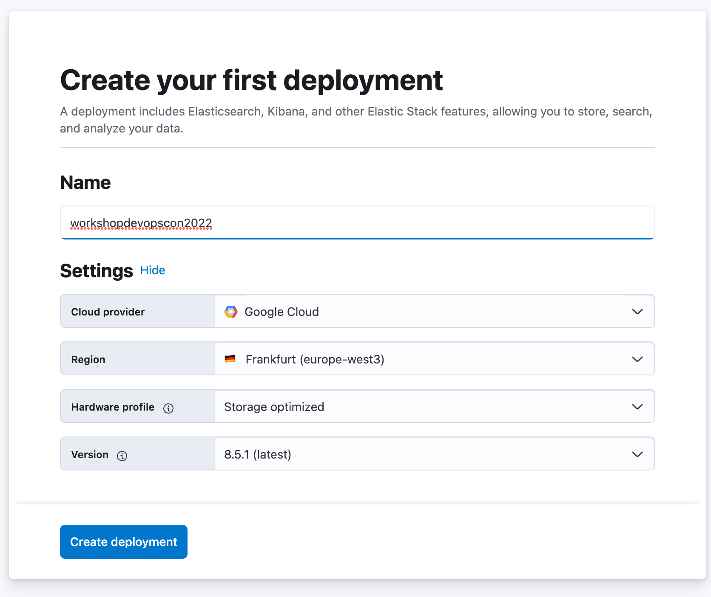
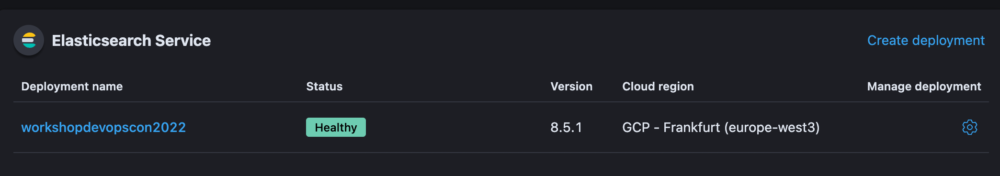
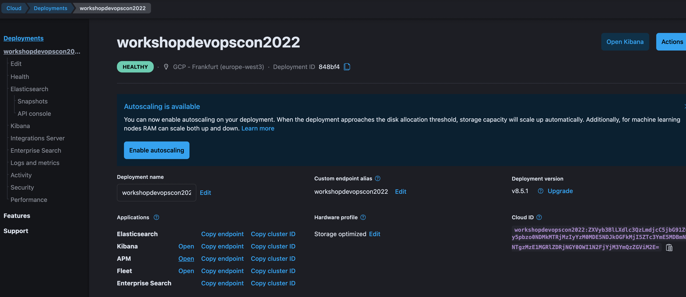
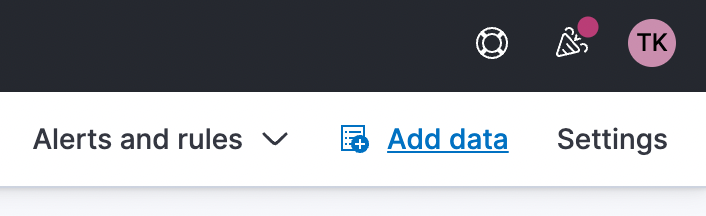
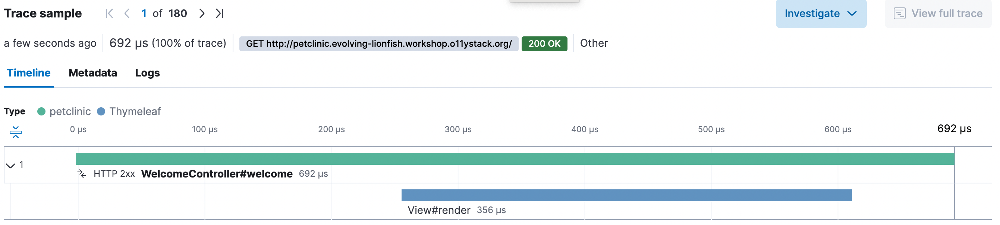
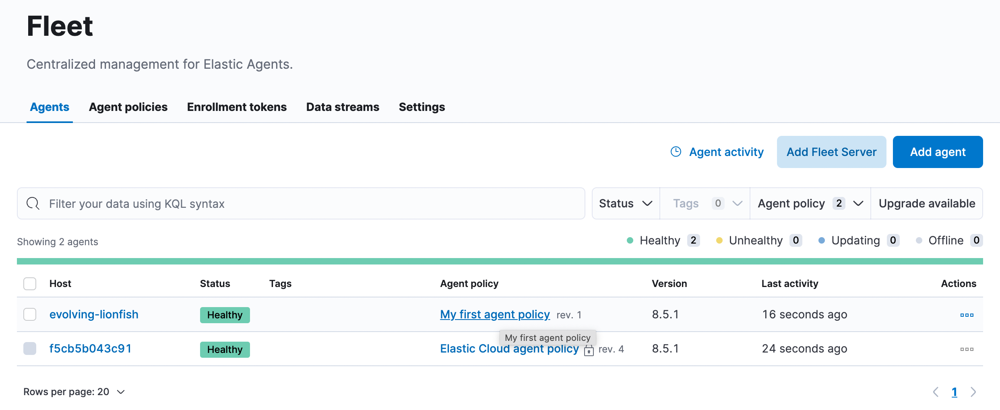
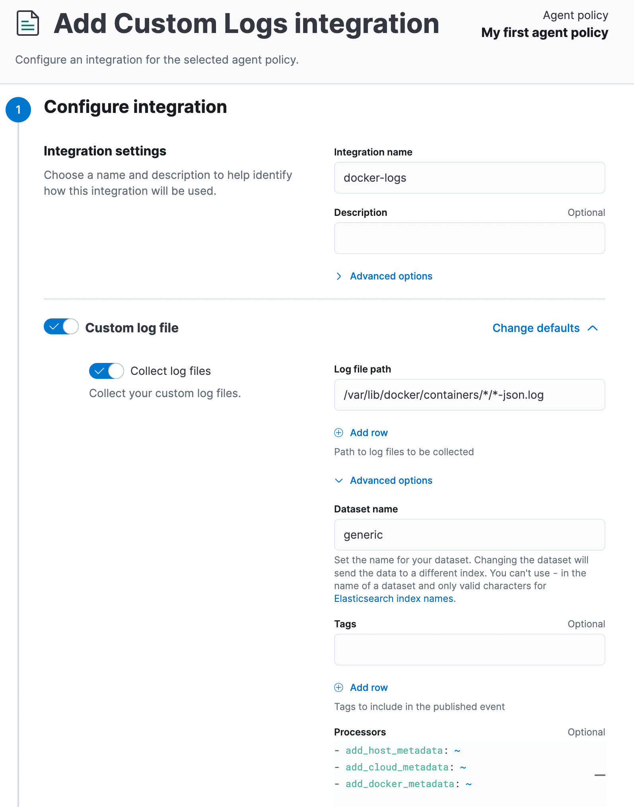
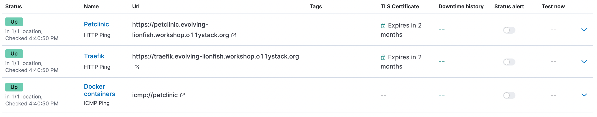

# 🦆 Elastic Cloud



We are going to [sign up for Elastic Cloud](https://cloud.elastic.co/registration). We'll be using
their free trial (14 days). Pick a name for your deployment (maybe your pet name?) and make sure
to select a european region for hosting.

> After creation, the `elastic` user credentials will be prompted once. Please safe
> them for later!

Spinning up your instances takes about 5-10 minutes. After that,
[log into Elastic Cloud](https://cloud.elastic.co/)

## 🥷 Elastic Java APM

We'll start with application performance monitoring. First, download the Elastic Java Agent

```bash
cd ~/o11y-workshop/elastic
sudo mkdir -p /usr/local/share/elastic
sudo curl -sLfo /usr/local/share/elastic/elastic-apm-agent.jar \
    https://repo1.maven.org/maven2/co/elastic/apm/elastic-apm-agent/1.34.1/elastic-apm-agent-1.34.1.jar
```

Configure instance metadata and secrets.

```bash
cd ~/o11y-workshop/elastic
../instance-metadata.sh > .env
```
To claim the secrets, [log into Elastic Cloud](https://cloud.elastic.co/) and click `Manage deployment`.




Forst, copy and save the `Cloud ID`

```bash
echo "ELASTIC_CLOUD_ID=[...]" >> .env
```



Click on `Open` next to the APM-Server and then `Add data` on the top right. Select
`Java` as APM Agent and note the APM server url and the secret token

```bash
echo "ELASTIC_APM_SERVER_URL=https://c42c9[...].apm.europe-west3.gcp.cloud.es.io:443" >> .env
echo "ELASTIC_APM_SECRET_TOKEN=MG2[...]"  >> .env
```

#### 🐾 Instrument the Petclinic

We already downloaded the Elastic APM agent and are now going to instrument
the Spring Petclinic.

```bash
cd ~/o11y-workshop/spring-petclinic
cp -f ~/o11y-workshop/elastic/.env .env
```

Now we have to add several environment variables to the Petclinic's Docker Compose
file. We also need to mount the downloaded Elastic APM agent into the Docker
container.

```yaml
environment:
  - ELASTIC_APM_SERVICE_NAME=petclinic
  - ELASTIC_APM_SERVER_URL=${ELASTIC_APM_SERVER_URL}
  - ELASTIC_APM_SECRET_TOKEN=${ELASTIC_APM_SECRET_TOKEN}
  - ELASTIC_APM_SERVICE_NODE_NAME=${HOSTNAME}
  - ELASTIC_APM_ENVIRONMENT=production
  - ELASTIC_APM_APPLICATION_PACKAGES=org.springframework.samples.petclinic
  - ELASTIC_APM_HOSTNAME=${HOSTNAME}
  - JAVA_TOOL_OPTIONS="-javaagent:/usr/local/share/elastic/elastic-apm-agent.jar"
volumes:
  - /usr/local/share/elastic:/usr/local/share/elastic
```

Verify in Elastic Cloud `APM` that traces are being written.



## 📖 Metrics and 🪵 Logs

Metrics and logs are written and ingested via the Elastic Agent. The Elastic Agent is controlled
via the `Elastic Fleet`.

To enroll the Elastic Agent into your Elastic Fleet, we need the Fleet secrets. Yet again,
[log into Elastic Cloud](https://cloud.elastic.co/) and click `Manage deployment`. Open Fleet
and go to `Fleet -> Settings`. Note the Fleet server host url and copy the `Enrollment token`.

> Now you also need the `elastic` user credentials from your initial setup.

```
cd ~/o11y-workshop/elastic
echo "ELASTIC_FLEET_HOST=https://848bf4[...].fleet.europe-west3.gcp.cloud.es.io:443" >> .env
echo "ELASTIC_FLEET_ENROLLMENT_TOKEN=SGsz[...]" >> .env
echo "ELASTIC_CLOUD_USER=elastic" >> .env
echo "ELASTIC_CLOUD_PASSWORD=rY7F[...]" >> .env
```

Make environment and secrets available in the current terminal

```
set -a; source .env; set +a
```

Now finally, install the Elastic agent

```
curl -sL -O https://artifacts.elastic.co/downloads/beats/elastic-agent/elastic-agent-8.5.1-amd64.deb
sudo dpkg -i elastic-agent-8.5.1-amd64.deb
sudo elastic-agent enroll --url=${ELASTIC_FLEET_HOST} --enrollment-token=${ELASTIC_FLEET_ENROLLMENT_TOKEN}
sudo systemctl enable elastic-agent
sudo systemctl start elastic-agent
```

Verify that your agent is connected to Fleet.



#### 🪵 Add integrations to the agent



> This is a lot of clicki-clicki 😔

Use the `Agent Policy` to add integrations. Search for and add the following integrations:

##### Docker Metrics

Should work straightforward.

##### Postgresql

Connect to `postgres://localhost:5432/petclinic?sslmode=disable` with username and password `petclinic`.

##### Custom Logs to harvest Docker logs


Harvest logs at `/var/lib/docker/containers/*/*-json.log` and configure the following
processors.

```yaml
- decode_json_fields:
    fields: ["message"]
    target: ""
    overwrite_keys: true
    add_error_key: true
- add_host_metadata: ~
- add_cloud_metadata: ~
- add_docker_metadata: ~
```

## 🫀 Heartbeat (uptime monitoring)

Another nice feature of the Elastic cloud is it's integrated heartbeat monitoring.

```
echo "GROUP_ID=$(id -g)" >> .env
echo "USER_ID=$(id -u)" >> .env
docker-compose -f docker-compose-heartbeat.yaml up
```

> Verify via `Observability -> Uptime -> Monitors` in Kibana




## 🚮 Uninstall

Stop the heartbeat Docker container and remove the `elastic-agent`.

```
docker-compose -f docker-compose-heartbeat.yaml down
sudo dpkg -P elastic-agent
```
