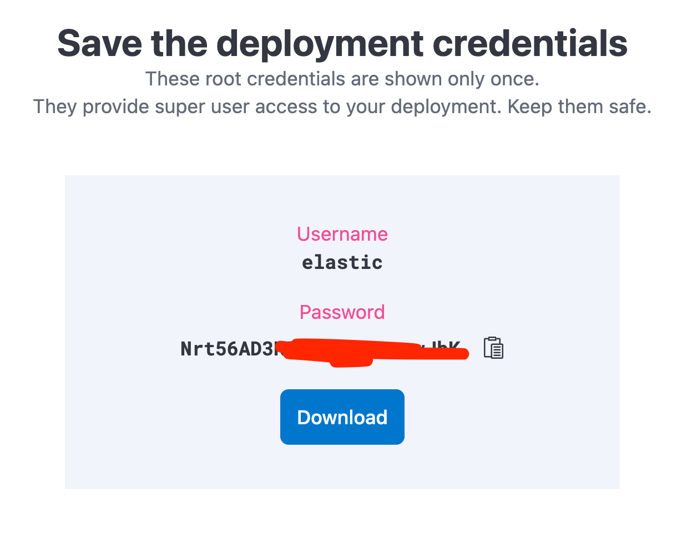
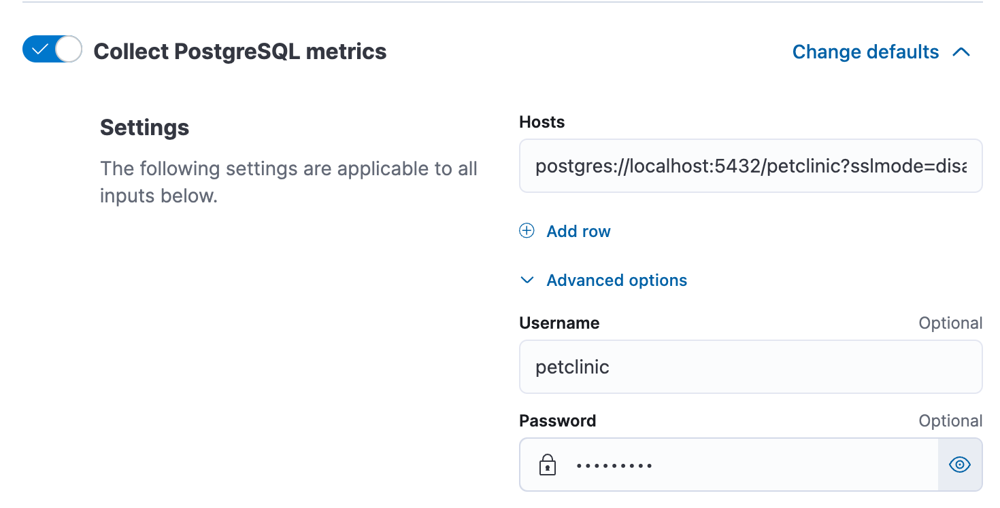

# 🦆 Elastic Cloud


We are going to [sign up for Elastic Cloud](https://cloud.elastic.co/registration). We'll be using
their free trial (14 days). Pick a name for your deployment (maybe your pet name?) and make sure
to select a european region for hosting.

> After creation, the `elastic` user credentials will be prompted once. Please safe
> them for later!

Spinning up your instances takes about 5-10 minutes. After that,
[log into Elastic Cloud](https://cloud.elastic.co/)




## 🥷 Elastic Java APM

We'll start with application performance monitoring. First, download the Elastic Java Agent

```bash
cd ~/o11y-workshop/elastic
sudo mkdir -p /usr/local/share/elastic
sudo curl -sLfo /usr/local/share/elastic/elastic-apm-agent.jar \
    https://repo1.maven.org/maven2/co/elastic/apm/elastic-apm-agent/1.38.0/elastic-apm-agent-1.38.0.jar
```

Configure instance metadata and secrets.

```bash
cd ~/o11y-workshop/elastic
../instance-metadata.sh > .env
```
To claim your Elastic cloud secrets, [log into Elastic Cloud](https://cloud.elastic.co/) and click `Manage deployment`.


Forst, copy and save the `Cloud ID`

```bash
echo "ELASTIC_CLOUD_ID=[...]" >> .env
```


Click on `Open` next to the APM-Server and then `Add data` on the top right. Select
`Java` as APM Agent and note the APM server url and the secret token

```bash
echo "ELASTIC_APM_SERVER_URL=https://c42c9[...].apm.europe-west3.gcp.cloud.es.io:443" >> .env
echo "ELASTIC_APM_SECRET_TOKEN=MG2[...]"  >> .env
```

#### 🐾 Instrument the Petclinic

We already downloaded the Elastic APM agent and are now going to instrument
the Spring Petclinic.

```bash
cd ~/o11y-workshop/spring-petclinic
cp -f ~/o11y-workshop/elastic/.env .env
```

Now we have to add several environment variables to the Petclinic's Docker Compose
file. We also need to mount the downloaded Elastic APM agent into the Docker
container.

```yaml
environment:
  - ELASTIC_APM_SERVICE_NAME=petclinic
  - ELASTIC_APM_SERVER_URL=${ELASTIC_APM_SERVER_URL}
  - ELASTIC_APM_SECRET_TOKEN=${ELASTIC_APM_SECRET_TOKEN}
  - ELASTIC_APM_SERVICE_NODE_NAME=${HOSTNAME}
  - ELASTIC_APM_ENVIRONMENT=production
  - ELASTIC_APM_APPLICATION_PACKAGES=org.springframework.samples.petclinic
  - ELASTIC_APM_HOSTNAME=${HOSTNAME}
  - JAVA_TOOL_OPTIONS="-javaagent:/usr/local/share/elastic/elastic-apm-agent.jar"
volumes:
  - /usr/local/share/elastic:/usr/local/share/elastic
```

Now restart the Petclinic and verify in Elastic Cloud `APM` that traces are being written.

```bash
cd ~/o11y-workshop/spring-petclinic
docker-compose restart petclinic
```

Look for the following log lines in the Petclinic log

```
spring-petclinic-petclinic-1   | Picked up JAVA_TOOL_OPTIONS: "-javaagent:/usr/local/share/elastic/elastic-apm-agent.jar"
[...]
spring-petclinic-petclinic-1   | 2023-06-09 10:57:55,992 [main] INFO  co.elastic.apm.agent.configuration.StartupInfo - Starting Elastic APM 1.38.0 as petclinic (3.0.0-SNAPSHOT) on Java 20.0.1 Runtime version: 20.0.1+9 VM version: 20.0.1+9 (Eclipse Adoptium) Linux 5.10.0-22-amd64
```


### 😰 Stress testing APM integration

[See our load testing recommendations](../LOADTEST.md)

### 🤯 Instrumenting the Traefik reverse proxy

After stress testing the app your might recall that your lacking
traces that do not reach the Petclinic. This can be overcome by
instrumenting the _Traefik_ reverse proxy as well.

To do that edit and restrt the Traefik SystemD unit:

```
vi /etc/systemd/system/traefik.service
systemctl daemon-reload
systemctl restart traefik.service
```

Add the following `--tracing.elastic` flags to the `ExecStart` parameter

```
[...]
ExecStart=/usr/bin/docker run --rm \
    -p 80:80 \
    -p 443:443 \
    [...]
    --entrypoints.websecure.address=:443 \
    --entryPoints.websecure.http.tls=true \
    --tracing.elastic=true \
    --tracing.elastic.serverurl="<YOUR_SERVER_URL>"    \
    --tracing.elastic.secrettoken="<YOUR_SECRET_TOKEN>"
```

After restarting the unit, a second service should appear in the
`Kibana -> Observability -> APM -> Services` view.

## 📖 Metrics and 🪵 Logs

Metrics and logs are written and ingested via the Elastic Agent. The Elastic Agent is controlled
via the `Elastic Fleet`. To enroll the Elastic Agent into your Elastic Fleet, we need the Fleet
secrets. Yet again, [log into Elastic Cloud](https://cloud.elastic.co/) and click `Manage deployment`.
Open Fleet and go to `Fleet -> Agent Policies` and create a new agent policy (name it to your liking).

Now note the secret enrollment token under `Fleet -> Enrollment tokens`
and the Fleet server host url under `Fleet -> Settings`.

> Now you also need the `elastic` user credentials from your initial setup.

```
cd ~/o11y-workshop/elastic
echo "ELASTIC_CLOUD_USER=elastic" >> .env
echo "ELASTIC_CLOUD_PASSWORD=<YOUR_INITIAL_ELASTIC_PASSWORD>" >> .env
echo "ELASTIC_FLEET_HOST=https://848bf4[...].fleet.europe-west3.gcp.cloud.es.io:443" >> .env
echo "ELASTIC_FLEET_ENROLLMENT_TOKEN=SGsz[...]" >> .env
```

#### 📀 Now finally install the Elastic agent

Download the agent to your machine (a whopping 500m download) and install it

```
$ curl -sL -O https://artifacts.elastic.co/downloads/beats/elastic-agent/elastic-agent-8.8.1-amd64.deb
$ sudo dpkg -i elastic-agent-8.8.1-amd64.deb
```

Now configure and enroll the Agent into your Elastic Fleet:

```
$ set -a; source .env; set +a
$ sudo elastic-agent enroll --url=${ELASTIC_FLEET_HOST} \
  --enrollment-token=${ELASTIC_FLEET_ENROLLMENT_TOKEN}
  Successfully enrolled the Elastic Agent.
$ sudo systemctl enable elastic-agent
$ sudo systemctl start elastic-agent
```

Verify that your agent is connected to Elastic Fleet.


#### 🪵 Add integrations to the agent

> This is a lot of clicki-clicki 😔

Use the `Agent Policy` to add integrations. Go to `Kibana -> Fleet -> Agent policies` and select
your created Agent policy. There, select `Add integration` and search for and add the following
integrations:

##### Docker Metrics & Logs

Should work straightforward.

##### Postgresql

> There are two identical integrations. Pick the one that collects
> logs and metrics.

In the `Collect PostgreSQL metrics` section, pick `Change defaults`
and connect to `postgres://localhost:5432/petclinic?sslmode=disable`. Under `Advanced options` configure username and password `petclinic`.



## 🫀 Heartbeat (uptime monitoring)

Another nice feature of the Elastic cloud is it's integrated heartbeat monitoring.

```
cd ~/o11y-workshop/elastic
echo "GROUP_ID=$(id -g)" >> .env
echo "USER_ID=$(id -u)" >> .env
docker-compose -f docker-compose-heartbeat.yaml up
```

> Verify via `Observability -> Uptime -> Monitors` in Kibana


## 😰 Stress testing Elastic

[See our load testing recommendations](../LOADTEST.md)

## 🚮 Uninstall

Stop the heartbeat Docker container and remove the `elastic-agent`.

```
docker-compose -f docker-compose-heartbeat.yaml down
sudo dpkg -P elastic-agent
```
