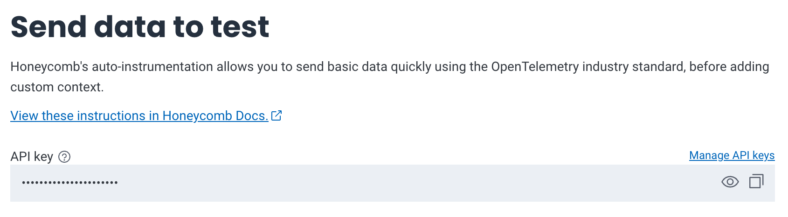
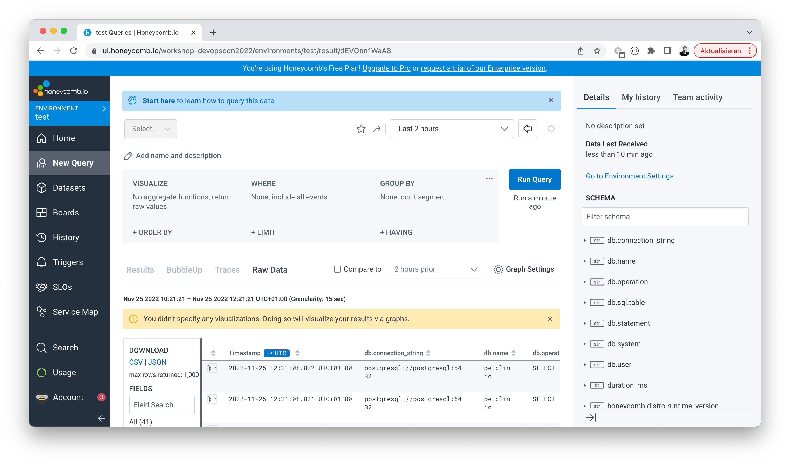
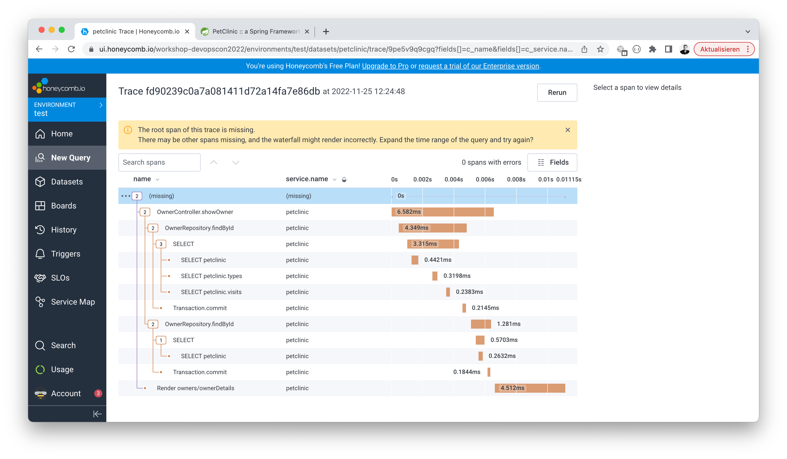

# 🐝 Honeycomb



Sign up for a [Honeycomb trial account](https://ui.honeycomb.io/signup). Upon
successfuly registration, store the API key in our environment.


```bash
cd ~/o11y-workshop/honeycomb
../instance-metadata.sh > .env
echo "HONEYCOMB_API_KEY=7HGXF1b5fvh2Fu8VfeXzea" >> .env
```

## 🥷 Honeycomb Java APM

Download the Honeycomb Opentelemetry Java Agent

```
sudo mkdir -p /usr/local/share/honeycomb
sudo curl -sLfo /usr/local/share/honeycomb/honeycomb-opentelemetry-javaagent.jar \
     https://github.com/honeycombio/honeycomb-opentelemetry-java/releases/latest/download/honeycomb-opentelemetry-javaagent.jar
```

Switch to the `spring-petclinic` directory and move the Honeycomb secrets here.

```
cd ~/o11y-workshop/spring-petclinic
cp -f ~/o11y-workshop/honeycomb/.env .env
```

Instrument the Petclinic to send trace metrics to Honeycomb.

```yaml
environment:
  - SERVICE_NAME=petclinic
  - HONEYCOMB_API_KEY=${HONEYCOMB_API_KEY}
  - HONEYCOMB_METRICS_DATASET=${HOSTNAME}
  - JAVA_TOOL_OPTIONS="-javaagent:/usr/local/share/honeycomb/honeycomb-opentelemetry-javaagent.jar"
volumes:
  - /usr/local/share/honeycomb:/usr/local/share/honeycomb
```

At first sight the Honeycomb interface is a bit "overwhelming".



Issue some HTTP requests on your Petclinic and look at the traces in
the _Home_ tab. This overview gives great insights.


