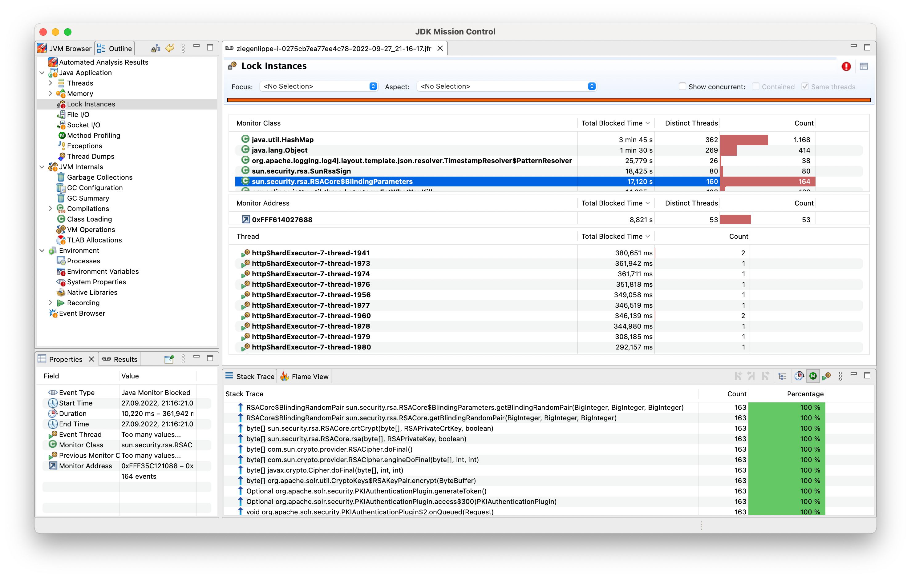

# 🛬 Java Flight Recorder

The Java flight recorder (JFR) is a great tool to gather extensive insights into
a running Java JRE. It's free and is shipped along every recent JDK (11+). The
observability process here has two steps

1. Record a Java Flight Recording of an application for given timeframe (e.g. 60s)
2. Analyze the recording using [JDK Mission Control](https://www.oracle.com/java/technologies/javase/products-jmc8-downloads.html)




## Prepare the Petclinic

Add the following volume mount to the Petclinic Docker Compose:

```yaml
services:
  petclinic:
    volumes:
      - ./../java-flight-recorder:/tmp/jfr
```

Afterwards, restart your Petclinic:

```
cd ~/o11y-workshop/spring-petclinic
docker-compose restart petclinic
```

## 📼 Create a flight recording

Create an on-demand recording inside the running Docker container.

```bash
docker exec -it spring-petclinic-petclinic-1 bash
JAVA_TOOL_OPTIONS="" jcmd $(pgrep java) JFR.start name=profile duration=60s filename=/tmp/jfr/petclinic-$(date '+%Y-%m-%d_%H-%M-%S').jfr settings=profile
JAVA_TOOL_OPTIONS="" jcmd $(pgrep java) JFR.check
```

Due to the directory mount, your JFR will appear in this directory.
You can download the file via VSCode (`Right click -> Download`).

## ✨ Analyze a flight recording

Install [JDK Mission Control](https://www.oracle.com/java/technologies/javase/products-jmc8-downloads.html) on your local laptop. Open the downloaded JFR recording with _JDK Mission Control_.

## 🛬 Configure the continuous flight recorder

Before stress testing the app, we want to configure the JVM to write a Flight
Recorder dump before exit. You can do so by supplying the following options
to the JVM.

```yaml
services:
  petclinic:
    environment:
      - JAVA_TOOL_OPTIONS=-XX:StartFlightRecording=disk=true,maxsize=128M,dumponexit=true,name=continuous,settings=default,filename=/tmp/jfr/petclinic-onexit.jfr
```

Restart your Petclinic instance

```
cd ~/o11y-workshop/spring-petclinic
docker-compose restart petclinic
```

Verify that the `JAVA_TOOL_OPTIONS` have been picked up by the JVM and that
the flight recorder is recording. It should look like this in the logs:

```
spring-petclinic-petclinic-1   | Picked up JAVA_TOOL_OPTIONS: -XX:StartFlightRecording=disk=true,maxsize=128M,dumponexit=true,name=continuous,settings=default,filename=/tmp/jfr/petclinic-onexit.jfr
spring-petclinic-petclinic-1   | [0.381s][info][jfr,startup] Started recording 1.
spring-petclinic-petclinic-1   | [0.381s][info][jfr,startup]
spring-petclinic-petclinic-1   | [0.381s][info][jfr,startup] Use jcmd 1 JFR.dump name=continuous to copy recording data to file.
```

## 😰 Stress testing

> 🤡 Yet again the fun part begins. Let's stress test our
> petclinic instrumented with the Java Flight Recorder and
> see the difference in observability!

```
hey -n 40000 -c 300 "https://petclinic.$(hostname).workshop.o11ystack.org/owners?lastName=$(hostname)"
```

* How is the application/host/database behaving?
* What is the first limit that the application is hitting? Can we somehow raise it?
* After increasing a limit, repeat the stress test

Activate one (or more) bugs in the application and repeat the stress test.
How is the application coping with the load then?

```
curl "https://petclinic.$(hostname).workshop.o11ystack.org/bugs/memory"
curl "https://petclinic.$(hostname).workshop.o11ystack.org/bugs/cpu"
curl "https://petclinic.$(hostname).workshop.o11ystack.org/bugs/locking"
```
