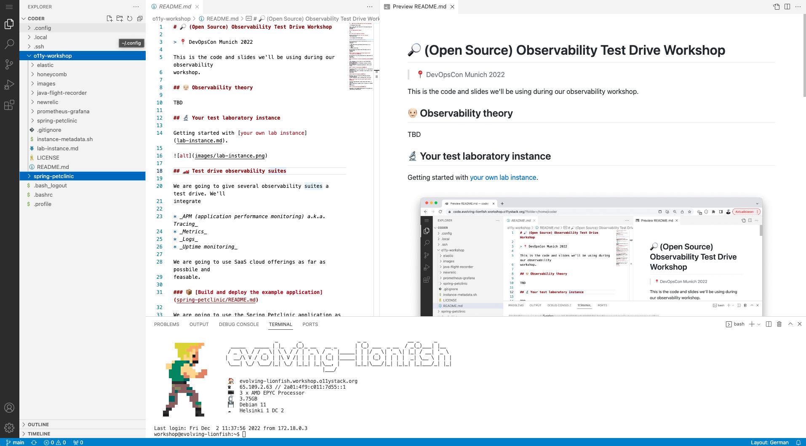

# 🔬 Lab instance

Every participant is supplied with it's own lab instance to play around
with. Here's what we have for your:

### 🎰 Instance setup

* Each instance is built using _Terraform_ and _Ansible_. Infrastructure
  as code is available in the [`workshop-cluster`](https://github.com/observabilitystack/workshop-cluster)
  repository.
* Each instance has a _PETNAME_ (e.g. `stirring-goshawk`)
* Instances can be reached at `PETNAME.workshop.o11ystack.org` and
  `*.PETNAME.workshop.o11ystack.org` (wildcard DNS entry)

### ⚙️ Running on the instance

On your instance we have prepared a Docker setup:

* Vital Docker services are launched as `SystemD` service units
  (`traefik.service` and `code-server.service`).
* All Docker instances communicate via the
  [`o11ystack` Docker network](https://github.com/observabilitystack/workshop-cluster/blob/workshops/devopscon-munich-2022/infrastructure/cluster/cloud-init/docker.yaml#L44).
* _Traefik_ acts as a HTTPS reverse proxy. All traffic is distributed
  on the host via the `o11ystack` Docker network. _Traefik_ picks up
  reverse proxy targets via Docker labels.
    * _Traefik_ is equipped with valid _ACME_ TLS certificates
    * The _Traefik_ admin ui can be reached at `https://traefik.PETNAME.workshop.o11ystack.org`


```
                   ┌────────────────────────────────────────┐
                   │ *.PETNAME.workshop.o11ystack.org │
                   ├────────────────────────────────────────┘─ ─ ─ ─ ─ ─ ─ ─ ─ ─ ─
                                                                                  │
                   │              ┌──────────────────┐
                                  │                  │                            │
                   │          ┌──▶│       code       │
                              │   │                  │                            │
                   │          │   └──────────────────┘
                              │                                                   │
                   │          │
             ┌─────────────┐  │   ┌──────────────────┐     ┌──────────────────┐   │
             │             │  │   │                  │     │                  │
───https────▶│   traefik   │──┼──▶│    petclinic     │────▶│     postgres     │   │
             │             │  │   │                  │     │                  │
             └─────────────┘  │   └──────────────────┘     └──────────────────┘   │
                   │          │
                              │                                                   │
                   │          │   ┌──────────────────┐
                              │   │                  │                            │
                   │          └──▶│    prometheus    │
                                  │                  │                            │
                   │              └──────────────────┘
                                                                                  │
                   │
                    ─ ─ ─ ─ ─ ─ ─ ─ ─ ─ ─ ─ ─ ─ ─ ─ ─ ─ ─ ─ ─ ─ ─ ─ ─ ─ ─ ─ ─ ─ ─ ┘
```

### 👩‍💻 Logging into your instance

> 💔 On your instance you have full `sudo` rights. Use that with caution!

We have a fully working Visual Studio Code instance running at

```https://code.PETNAME.workshop.o11ystack.org```

Use the Terminal in Visual Studio Code to connect to your instance.



We have checked out the following projects in your root directory.

* `/o11y-workshop` - this repository
* `/spring-petclinic` - our fork of the [Spring Petclinic](https://github.com/observabilitystack/spring-petclinic)
