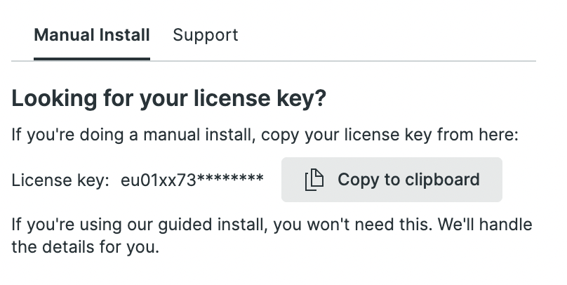
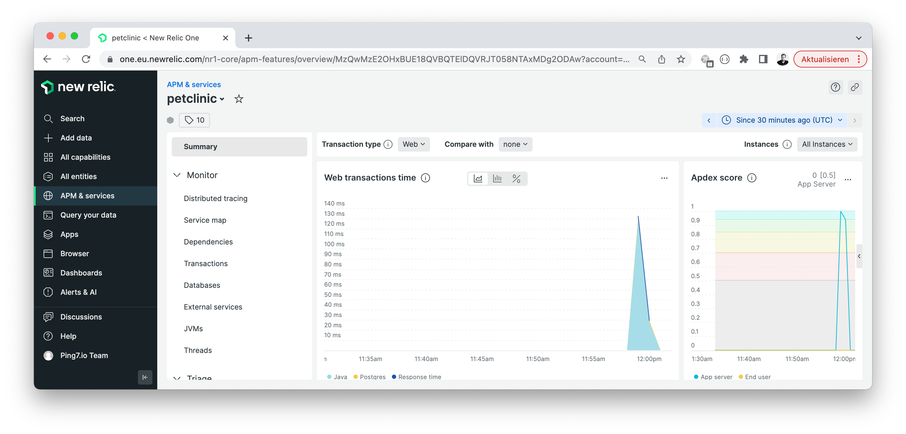
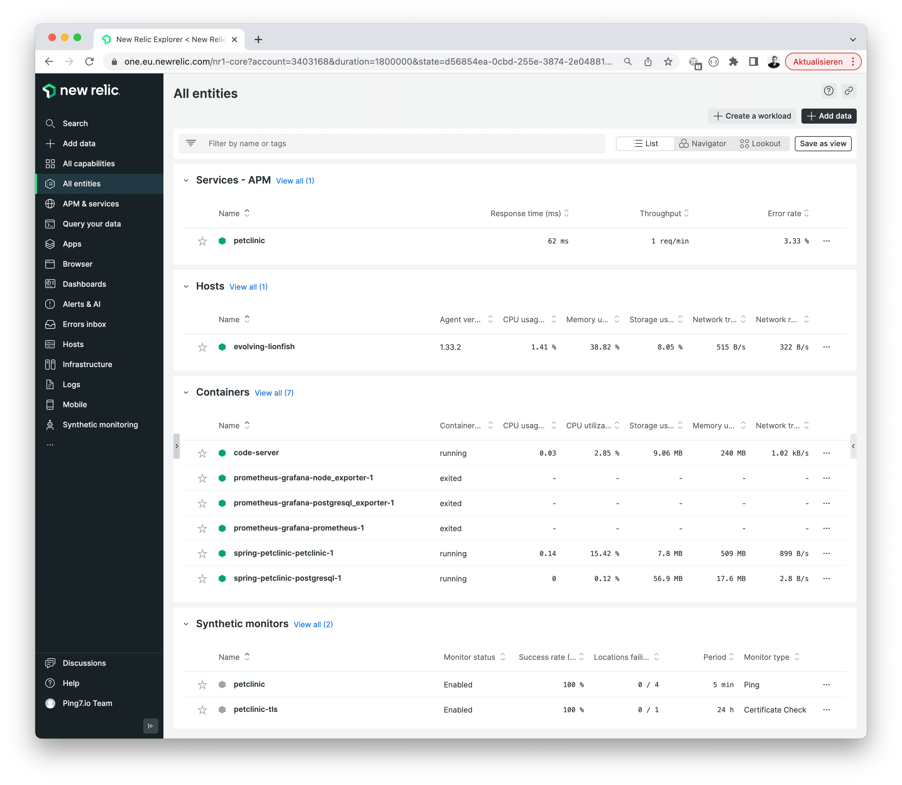
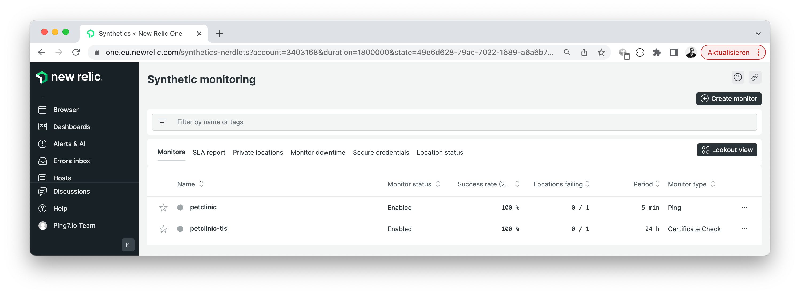

# 💰 New Relic integration

Sign up for a new [New Relic trial](https://newrelic.com/de/signup). Log into
New Relic, click `Add data -> Java` and copy your New Relic license key.



```bash
cd ~/o11y-workshop/newrelic
echo "NEW_RELIC_LICENSE_KEY=eu01xx73..." > .env
```

## 🥷 Tracing

Download and store the New Relic Java agent

```bash
cd ~/o11y-workshop/newrelic
curl -sLfo /tmp/newrelic-java.zip \
    https://download.newrelic.com/newrelic/java-agent/newrelic-agent/current/newrelic-java.zip
sudo unzip /tmp/newrelic-java.zip -d /usr/local/share
```

#### 🐾 Instrument the Petclinic

Switch to the Petclinic directory ...

```bash
cd ~/o11y-workshop/spring-petclinic
cat ~/o11y-workshop/newrelic/.env >> ~/o11y-workshop/spring-petclinic/.env
```

... and configure your Petclinic's Docker Compose file. We also need to mount the downloaded
New Relic agent into the Docker container.

```yaml
environment:
  - NEW_RELIC_APP_NAME="petclinic"
  - NEW_RELIC_LICENSE_KEY="${NEW_RELIC_LICENSE_KEY}"
  - NEW_RELIC_LOG_FILE_NAME=STDOUT
  - JAVA_TOOL_OPTIONS="-javaagent:/usr/local/share/newrelic/newrelic.jar"
volumes:
  - /usr/local/share/newrelic:/usr/local/share/newrelic
```



## 📖 Metrics and 🪵 Logs

New Relic supplies the New Relic Agent that takes care od system and infrastructure metrics
as well as log shipping. We are going to install it. First, make our secrets available in
the current terminal

```
cd ~/o11y-workshop/newrelic
set -a; source .env; set +a
```

Then install the agent

```
echo "license_key: ${NEW_RELIC_LICENSE_KEY}" | sudo tee -a /etc/newrelic-infra.yml
curl -s https://download.newrelic.com/infrastructure_agent/gpg/newrelic-infra.gpg | sudo apt-key add -
printf "deb https://download.newrelic.com/infrastructure_agent/linux/apt bullseye main" | sudo tee -a /etc/apt/sources.list.d/newrelic-infra.list
sudo apt-get update
sudo apt-get install newrelic-infra -y
systemctl status newrelic-infra.service
```

> Verify in the New Relic UI that your infrastructure metrics are available



#### 💾 Postgres integration

Next, install the Postgresql extension to monitor our Postgres database.

```
sudo apt-get install nri-postgresql -y
sudo cp rootfs/etc/newrelic-infra/integrations.d/postgresql-config.yml \
    /etc/newrelic-infra/integrations.d/postgresql-config.yml
sudo systemctl restart newrelic-infra.service
```

### 🌍 Synthetic uptime monitoring



## 🚮 Uninstall

```
sudo apt-get remove -y newrelic-infra nri-postgresql
```
