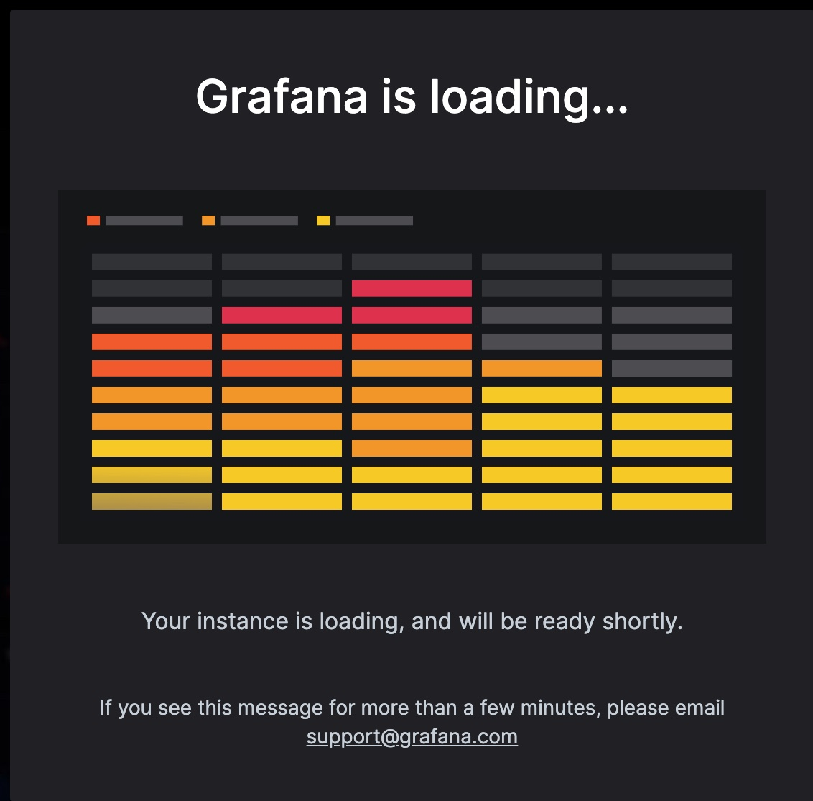

# Grafana - Integration


* Sign up for a free account grafana.com





### Prepare environment

This writes some instance metadata into a Docker Compose environment
file. We'll pick those values up when launching Docker containers.

```
./instance-metadata.sh > .env
```

## Metrics Integration via local Prometheus

1. Prepare the Prometheus configuration by templating using `envsubst`:

```
$ envsubst < rootfs/etc/prometheus/prometheus.yaml.template > rootfs/etc/prometheus/prometheus.yaml
```

2. Launch Prometheus

```
docker-compose -f docker-compose-metrics.yaml up -d
```

3. Verify that [your Prometheus is running](https://prometheus.PETNAME.workshop.o11ystack.org/). Check what targets and services
he discovered OOTB

4. Configure your local Prometheus as data source in Grafana Cloud


5. Import Dashboards into Grafana Cloud

* https://grafana.com/grafana/dashboards/1860-node-exporter-full/
* https://grafana.com/grafana/dashboards/4701-jvm-micrometer/
* https://grafana.com/grafana/dashboards/9628-postgresql-database/
* https://grafana.com/grafana/dashboards/11462-traefik-2/


## Log Management


Now, append your personal secrets to the environment file

```
echo "GRAFANA_LOKI_USERNAME=32.. >> .env"
echo "GRAFANA_API_KEY=eyJrIjoi.. >> .env"
```

https://grafana.com/orgs/workshopdevopscon2022
https://grafana.com/orgs/workshopdevopscon2022/hosted-logs/322443#sending-logs


## Tracing

Now, append your personal secrets to the environment file

```
echo "GRAFANA_TEMPO_USERNAME=3.. >> .env"
```

sudo curl -sLfo /usr/local/share/opentelemetry-javaagent.jar "https://github.com/open-telemetry/opentelemetry-java-instrumentation/releases/download/v1.19.2/opentelemetry-javaagent.jar"

```yaml
environment:
    - OTEL_EXPORTER=otlp_span
    - OTEL_EXPORTER_OTLP_ENDPOINT=http://grafana_agent:4317
    - OTEL_EXPORTER_OTLP_INSECURE=true
    - OTEL_RESOURCE_ATTRIBUTES=service.name=petclinic
    - JAVA_TOOL_OPTIONS="-javaagent:/usr/local/share/opentelemetry-javaagent.jar"
volumes:
  - /usr/local/share/opentelemetry-javaagent.jar:/usr/local/share/opentelemetry-javaagent.jar
```
