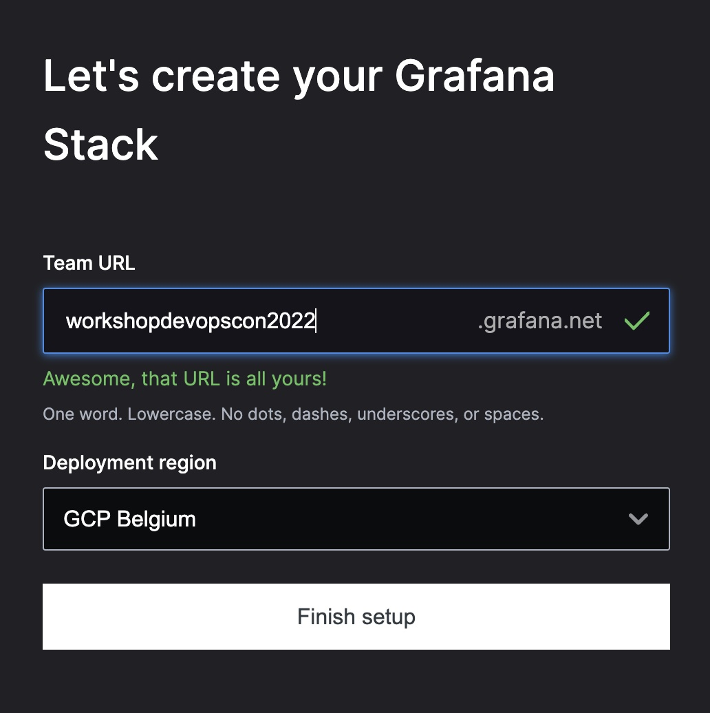
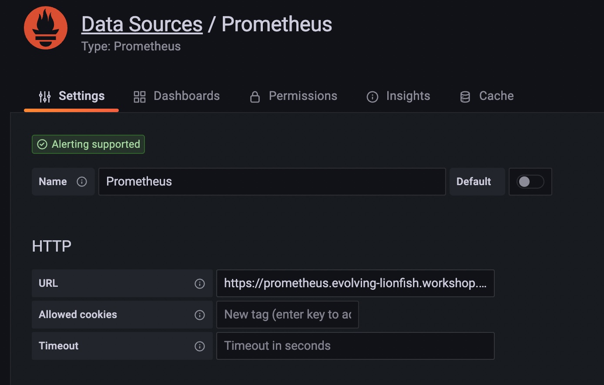
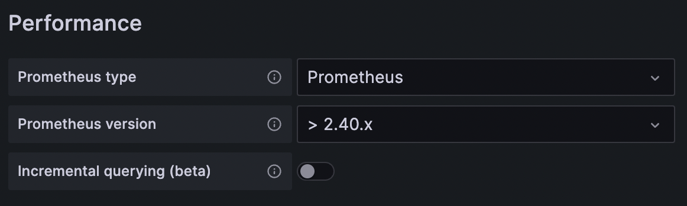
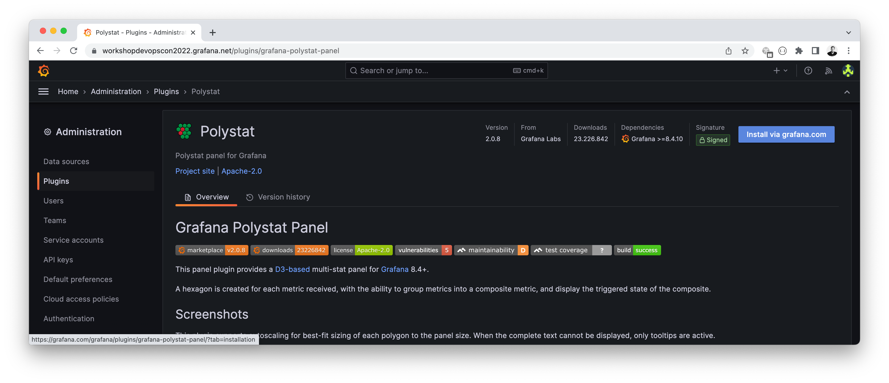
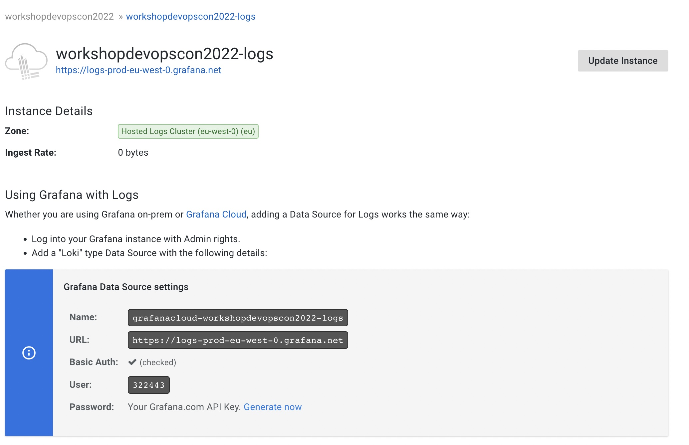
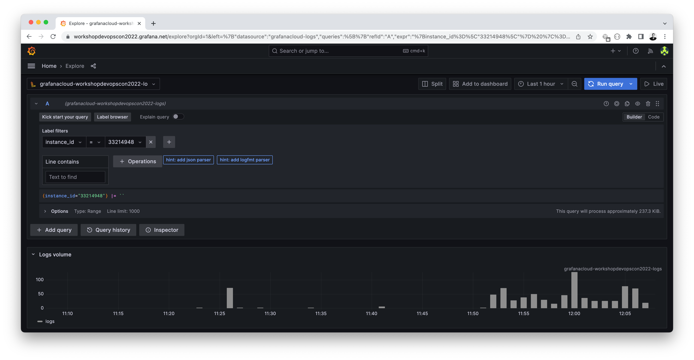
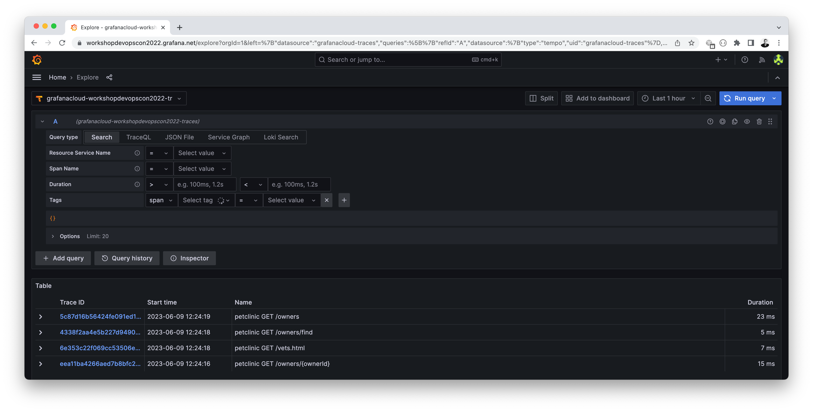
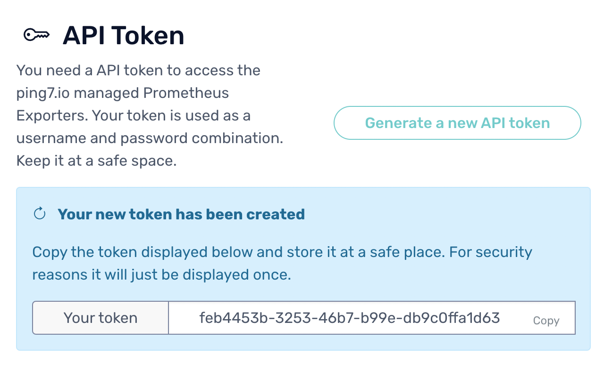
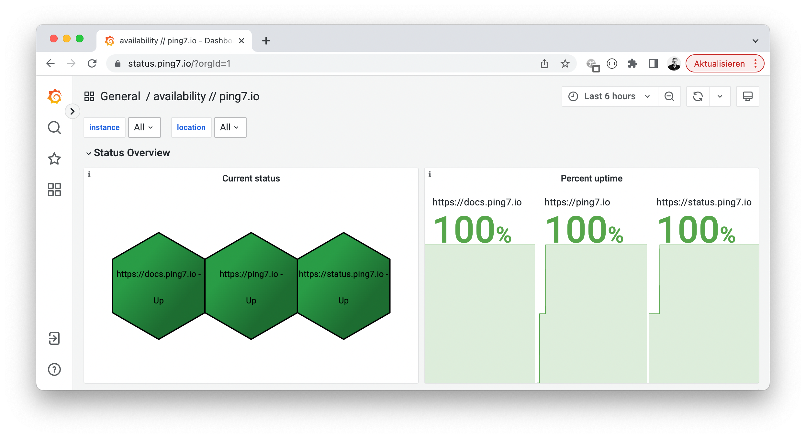

# 🪡 Grafana - Integration



Before we start, sign up for a [free account grafana.com](https://grafana.com/auth/sign-up/create-user?pg=hp&plcmt=hero-btn1&cta=create-free-account)

- [🪡 Grafana - Integration](#-grafana---integration)
    - [🔬 Prepare lab environment](#-prepare-lab-environment)
  - [📖 Metrics (via a local Prometheus)](#-metrics-via-a-local-prometheus)
    - [Launch a local Prometheus](#launch-a-local-prometheus)
    - [Configure Grafana Cloud](#configure-grafana-cloud)
      - [Configure Prometheus Data Source](#configure-prometheus-data-source)
      - [Import Dashboards into Grafana Cloud](#import-dashboards-into-grafana-cloud)
  - [🚨 Alerts](#-alerts)
    - [✨ Adding alerts](#-adding-alerts)
  - [🪵 Log Management](#-log-management)
  - [🥷 Tracing](#-tracing)
      - [🐾 Instrument the Petclinic](#-instrument-the-petclinic)
      - [🧐 Explore incoming Traces](#-explore-incoming-traces)
  - [🌍 Uptime monitoring](#-uptime-monitoring)
  - [😰 Stress testing](#-stress-testing)
  - [🚮 Uninstall](#-uninstall)


### 🔬 Prepare lab environment

This writes some instance metadata into a Docker Compose environment
file. We'll use those values when launching Docker containers for tagging
logs and traces.

```
cd ~/o11y-workshop/prometheus-grafana
../instance-metadata.sh > .env
cat .env
```

## 📖 Metrics (via a local Prometheus)

We'll not use the Prometheus provided by Grafana Cloud. Instead we are deploying
our own Prometheus on our instance. That way we can access internal resources
without making them accessible to Grafana Cloud.

```
┌─────────────────────┐
│    Grafana Cloud    │
│                     │          ┌─────────────────────────────────┐
└─────────────────────┘          │ PETNAME.workshop.o11ystack.org  │
           │                     ├─────────────────────────────────┴──────────┐
           │                     │  ┌────────────┐            ┌────────────┐  │
           └─────────────────────┼─▶│ Prometheus │─────┬─────▶│ Petclinic  │  │
                                 │  └────────────┘     │      └────────────┘  │
                                 │                     │      ┌────────────┐  │
                                 │                     └─────▶│ Postgresql │  │
                                 │                            └────────────┘  │
                                 └────────────────────────────────────────────┘
```

> 💡 This deplyoment pattern is common to overcome the rather limited
> free metrics volume in Grafana Cloud


### Launch a local Prometheus

Apply the instance metadata we created above to prepare the
Prometheus configuration. We are templating using `envsubst`:

```
set -a; source .env; set +a
envsubst < rootfs/etc/prometheus/prometheus.yaml.template > rootfs/etc/prometheus/prometheus.yaml
```

Now launch Prometheus

```
docker-compose -f docker-compose-metrics.yaml up -d
```

Verify that [your Prometheus is running](https://prometheus.PETNAME.workshop.o11ystack.org/). Check what targets and services
he discovered out of the box.

### Configure Grafana Cloud

[Log into your Grafana cloud account](https://grafana.com/auth/sign-in)
and launch Grafana.

#### Configure Prometheus Data Source



Go to `Connections -> Data Sources` and add a new Prometheus Data Source.
Make it default and use the url `https://prometheus.PETNAME.workshop.o11ystack.org`.
Under _Performance_ select the most recent Prometheus version.



> You can verify that your metrics are available in Grafana using the `Explore` section.

#### Import Dashboards into Grafana Cloud


In Grafana, import the following Dashboards using their Grafana Cloud ID

* `1860` - [Node Exporter](https://grafana.com/grafana/dashboards/1860-node-exporter-full/)
* `4701`- [JVM Micrometer](https://grafana.com/grafana/dashboards/4701-jvm-micrometer/)
* `9628` - [Postgresql](https://grafana.com/grafana/dashboards/9628-postgresql-database/)
* `11462` - [Traefik 2](https://grafana.com/grafana/dashboards/11462-traefik-2/)
* `18674` - [Prometheus Blackbox Exporter (Multiple Locations)](https://grafana.com/grafana/dashboards/18674-availability-ping7-io/)


For superb visibility, install the _Polystat Plugin_. Navigate to `Home -> Administration -> Plugins`,
filter for `all` and search and install the `Polystat Plugin`



## 🚨 Alerts


Launch an Alertmanager instance to manage alert dispatching. You can visit
the Alertmanager UI using `https://alertmanager.PETNAME.workshop.o11ystack.org`.

```
cd ~/o11y-workshop/prometheus-grafana
docker-compose -f docker-compose-alerts.yaml up -d
```

To scrape Alertmanager metrics from within Prometheus, update the
Prometheus configuration and restart your Prometheus instance afterwards.

```bash
set -a; source .env; set +a
envsubst < rootfs/etc/prometheus/prometheus.alertmanager.yaml.template \
    >> rootfs/etc/prometheus/prometheus.yaml
docker-compose -f docker-compose-metrics.yaml restart prometheus
```

In Grafana.com, go to `Connections -> Data Sources` and add a new Alertmanager Data Source.
Make it default and use the url `https://alertmanager.PETNAME.workshop.o11ystack.org`. Make
sure to set the _Prometheus_ implementation.

In Grafana.com, you can now browse your Prometheus alerts `Alerts & IRM > Alerting > Alert Rules`.

### ✨ Adding alerts

Alerts reside in `rootfs/etc/prometheus/alerts`. If you want,
craft your own alerts.


## 🪵 Log Management



[Log into your Grafana cloud account](https://grafana.com/auth/sign-in)
and select `Loki -> Details`. Here you'll find the credentials you need
to ingest log data to Grafana Loki.

Append these personal secrets to the environment file:

```
echo "GRAFANA_LOKI_USERNAME=<YOUR_LOKI_USER>" >> .env
echo "GRAFANA_API_KEY=<YOUR_GRAFANA_API_KEY>" >> .env
```

> ♻️ if you do not know your Grafana API key, create a new one with the _Admin_ role


We use Promtail as log ingester which we launch in a Docker container

```
cd ~/o11y-workshop/prometheus-grafana
docker-compose -f docker-compose-logs.yaml up
```

> You can verify that your logs are available in Grafana using the `Explore` section.



## 🥷 Tracing

For tracing we'll set up a _Grafana Agent_ authentication proxy. Traces are sent
from the _Petclinic_ application to the authentication proxy who forwards the
traces to Tempo in Grafana Cloud.

```
┌─────────────────────┐
│    Grafana Cloud    │
│       (Tempo)       │          ┌─────────────────────────────────┐
└─────────────────────┘          │ PETNAME.workshop.o11ystack.org  │
           ▲                     ├─────────────────────────────────┴──────────┐
           │                     │  ┌────────────┐                            │
           │                     │  │  Grafana   │            ┌────────────┐  │
           └─────────────────────┼──│   Agent    │◀───────────│ Petclinic  │  │
                                 │  └────────────┘            └────────────┘  │
                                 └────────────────────────────────────────────┘
```

[Log into your Grafana cloud account](https://grafana.com/auth/sign-in)
and select `Tempo -> Details`. Here you'll find the credentials you need
to ingest log data to Grafana Tempo.

Append these personal secrets to the environment file:

```
echo "GRAFANA_TEMPO_USERNAME=<YOUR_TEMPO_USER>" >> .env
```

We'll launch a a Grafana Agent as tracing proxy that authenticates against Grafana
Cloud.

```
docker-compose -f docker-compose-tracing.yaml up -d
```

> This proxy pattern is pretty common (pretty much like a federated Prometheus)

> The Grafana Agent can be reached via a Docker network as `grafana_agent`.

#### 🐾 Instrument the Petclinic

Grafana uses the bare Open Telemetry Java Agent to instrument an application.
We can download a recent release from GitHub.

```bash
cd ~/o11y-workshop/spring-petclinic
sudo curl -sLfo /usr/local/share/opentelemetry-javaagent.jar \
    "https://github.com/open-telemetry/opentelemetry-java-instrumentation/releases/download/v1.26.0/opentelemetry-javaagent.jar"
```

Now we have to add several environment variables to the Petclinic's Docker Compose
file. We also need to mount the downloaded OpenTelemetry agent into the Docker
container.

```yaml
environment:
    - OTEL_EXPORTER=otlp_span
    - OTEL_EXPORTER_OTLP_ENDPOINT=http://grafana_agent:4317
    - OTEL_EXPORTER_OTLP_INSECURE=true
    - OTEL_RESOURCE_ATTRIBUTES=service.name=petclinic
    - JAVA_TOOL_OPTIONS="-javaagent:/usr/local/share/opentelemetry-javaagent.jar"
volumes:
  - /usr/local/share/opentelemetry-javaagent.jar:/usr/local/share/opentelemetry-javaagent.jar
```

When done, restart the petclinic

```bash
docker-compose restart petclinic
```

Watch for these log lines when starting the Petclinic:

```
spring-petclinic-petclinic-1   | Picked up JAVA_TOOL_OPTIONS: "-javaagent:/usr/local/share/opentelemetry-javaagent.jar"
spring-petclinic-postgresql-1  | running bootstrap script ... ok
spring-petclinic-petclinic-1   | OpenJDK 64-Bit Server VM warning: Sharing is only supported for boot loader classes because bootstrap classpath has been appended
spring-petclinic-petclinic-1   | [otel.javaagent 2023-06-09 10:15:55:382 +0000] [main] INFO io.opentelemetry.javaagent.tooling.VersionLogger - opentelemetry-javaagent - version: 1.26.0
```

#### 🧐 Explore incoming Traces

You can verify that your traces are available in Grafana using the `Explore` section.

> If traces are not appearing, please check the logs of the Grafana Agent!




## 🌍 Uptime monitoring

Create a [free account at ping7.io](https://ping7.io/login) and save
your API token.



Add your API token to your environment secrets.

```
cd ~/o11y-workshop/prometheus-grafana
echo "PING7IO_TOKEN=<YOUR_PING7_IO_TOKEN>" >> .env
```

Now append a new scrape job to your existing Prometheus configuration.
Restart Prometheus afterwards.

```bash
set -a; source .env; set +a
envsubst < rootfs/etc/prometheus/prometheus.ping7io.yaml.template \
    >> rootfs/etc/prometheus/prometheus.yaml
docker-compose -f docker-compose-metrics.yaml restart prometheus
```

1. Check that your uptime metrics are scraped in Prometheus (`Targets`)
1. Also check the available metrics in Grafana. Use the `Explore` section
  end explore metrics prefixed `probe_`
1. You can add a [Blackbox-Exporter Dashboard to Grafana](https://github.com/ping7io/examples/blob/main/dashboards/blackbox-exporter-ping7.io.json)
in order to visualize those.




## 😰 Stress testing

[See our load testing recommendations](../LOADTEST.md)


## 🚮 Uninstall

Shut down all Docker containers we just launched.

```bash
docker-compose -f docker-compose-metrics.yaml down
docker-compose -f docker-compose-alerts.yaml down
docker-compose -f docker-compose-logs.yaml down
docker-compose -f docker-compose-tracing.yaml down
```
