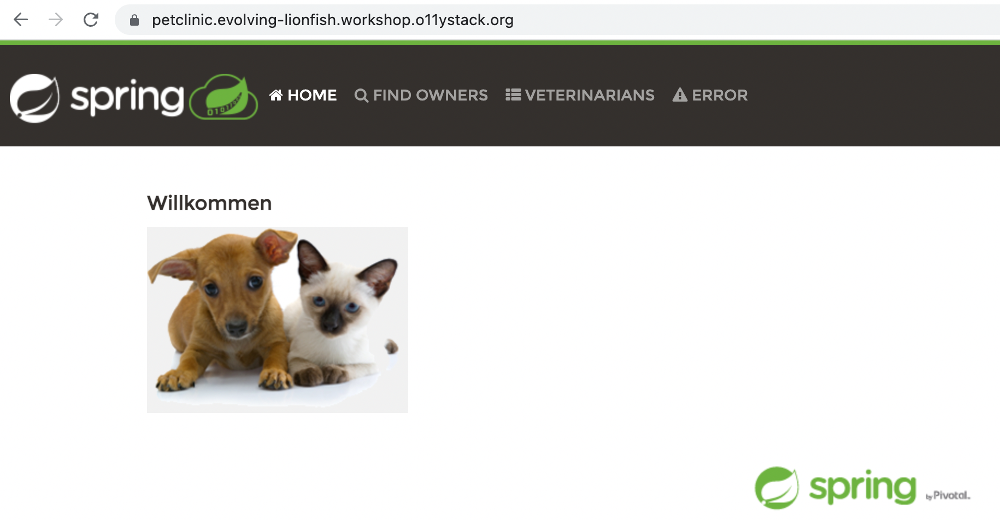

# 📦 Spring Petclinic example application

The Spring framework provides a well know showcase named
_Petclinic_. It's a easy CRUD web application showcasing the
capabilities of the Spring Boot framework.

We created our [own fork of the project](https://github.com/observabilitystack/spring-petclinic).

### 📦 Build the Petclinic

Our project fork is already checked out on your instance in
the `spring-petclinic` folder. SSH into your machine and
start the Docker build.

```
$ cd ~/spring-petclinic
$ docker build -t observabilitystack/spring-petclinic .
```

> Building takes a while (~5m) and will store the Docker
> image in your instance's Docker build cache.

### 🚚 Deploy the Petclinic

After building the Petclinic you can launch the Docker
container. We prepared a _Docker Compose_ file for that.

```
$ cd ~/o11y-workshop/spring-petclinic
$ docker-compose up -d
```

Connect to your Petclinic at [petclinic.PETNAME.workshop.o11ystack.org](https://petclinic.PETNAME.workshop.o11ystack.org).



### Links

* [Spring Petclinic](https://github.com/spring-projects/spring-petclinic)
* [Additional features we added to the Petclinic](https://github.com/spring-projects/spring-petclinic/compare/main...observabilitystack:spring-petclinic:main)
